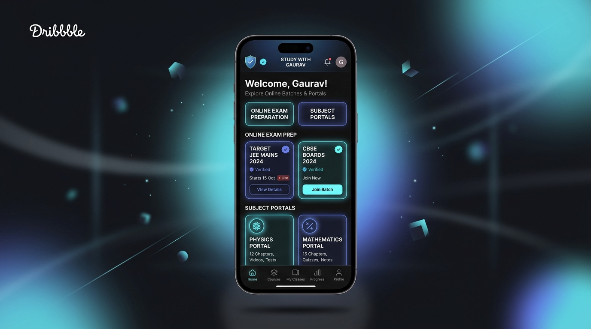
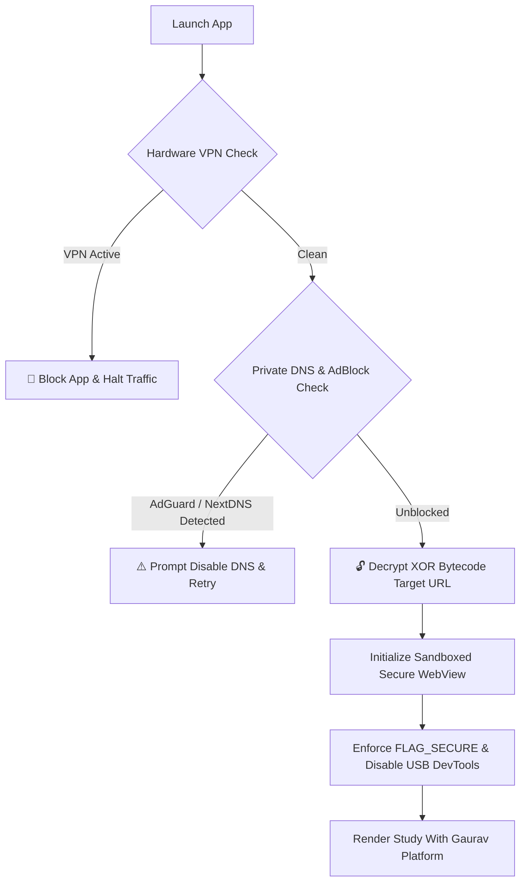

<div align="center">

  

  # 🎓 Study With Gaurav
  ### *The Ultimate Educational Super-Hub & Secure Mobile Android Application*

  <p align="center">
    <b>Free JEE • NEET • SSC • CDS/NDA • State Boards • Competitive Exam Batches & Notes</b>
  </p>

  [](https://studywithgaurav.cc.cd)
  [-06B6D4?style=for-the-badge&logo=android&logoColor=white)](https://studywithgaurav.cc.cd/download)
  [](https://developer.android.com)
  [](#)
  [](#-advanced-security--anti-leak-architecture)

  <br />

  <a href="https://studywithgaurav.cc.cd/download">
    
  </a>

</div>

<br />

---

## 📱 App Interface Preview

<div align="center">
  
  <p><i>Figure 1: High-performance, dark-themed native interface with instant batch navigation and verified learning channels.</i></p>
</div>

---

## 🌟 About Study With Gaurav

**Study With Gaurav** is a next-generation centralized educational portal and Android mobile application designed to bridge the gap between quality education and aspiring students across India. 

From **IIT-JEE, NEET, and SSC CGL** to **NDA, CDS, State Boards, and English Speaking**, the platform aggregates verified, top-tier video lectures, revision portals, free batch streams, and handwritten notes into a unified, lightning-fast experience.

### 🎯 Key Highlights:
- 🚀 **100+ Integrated Educational Portals**: Direct, seamless access to Physics Wallah, Unacademy, Khan Global Studies, Rojgar With Ankit, Careerwill, Next Toppers, Selection Way, and more.
- ⚡ **Zero-Lag Native WebView Experience**: GPU-accelerated smooth scrolling, pull-to-refresh (`SwipeRefreshLayout`), and responsive dark-mode styling.
- 📂 **Full Offline / Download Capability**: Lightweight 4.3 MB installer with low memory footprint and high battery efficiency.
- 🛡️ **Military-Grade Security & Anti-Leak Armor**: Hardware-level VPN prevention, private DNS sinkhole detection, and obfuscated bytecode.

---

## 🛡️ Advanced Security & Anti-Leak Architecture

<div align="center">
  
  <p><i>Figure 2: Multi-tiered defensive framework preventing unauthorized VPN tunneling, ad-stripping DNS filters, and code leakage.</i></p>
</div>

The application employs an uncompromising **multi-layer defensive perimeter** across both the Android native environment and web runtime:



### 1. 🚫 Hardware & Native VPN Blocker
- **Network Capabilities Inspector**: Real-time evaluation of `NetworkCapabilities.TRANSPORT_VPN` and `NET_CAPABILITY_NOT_VPN` using Android's native `ConnectivityManager`.
- **Virtual Adapter Sweep**: Scans all active system interfaces for virtual tunnel signatures: `tun0`, `ppp0`, `p2p`, `tap`, `wg0` (WireGuard), and `ipsec`.
- **System Proxy Trap**: Detects system-level HTTP/SOCKS proxies (`http.proxyHost`, `socksProxyHost`).
- **Reactive Network Callback**: If a user turns on a VPN tunnel while browsing, the app dynamically freezes execution and brings up a non-dismissible warning card.

### 2. ⚠️ Ad-Blocker & Private DNS Blocker
- **Private DNS Sinkhole Detection**: Inspects Android 9+ `Settings.Global` for custom private DNS configurations (`dns.adguard.com`, `nextdns.io`, `controld`).
- **Ad Resolution Probing**: Periodically verifies DNS resolution against standard Google AdSense endpoints (`pagead2.googlesyndication.com`). If an ad filter sinkholes resolution to `0.0.0.0`, access is blocked until disabled.
- **Client DOM Bait**: Web-layer traps catch extensions like uBlock Origin, Adblock Plus, and Brave Shields, showing a clear instruction modal to support the platform.

### 3. 🔒 URL & API Anti-Leak Hardening
- **Zero-Plaintext Bytecode Obfuscation**: The production URL (`studywithgaurav.cc.cd`) is stored as an **XOR-encoded byte array (Key `0x5B`)**. Decompilation tools (`apktool`, `jadx`, `strings`) will not find the domain in plaintext.
- **No Chrome USB DevTools**: `WebView.setWebContentsDebuggingEnabled(false)` prevents inspecting network traffic or DOM elements over ADB.
- **Screenshot & Recording Prevention (`FLAG_SECURE`)**: Prevents screenshots, video recordings, and task switcher snapshots.
- **Clipboard & Link Protection**: Long-press context menus (`setOnLongClickListener { true }`) and text selection are disabled to prevent copying batch destinations.
- **Web Console Protection**: Client-side right-click context menu and developer hotkeys (`F12`, `Ctrl+Shift+I`, `Ctrl+U`, `Ctrl+S`) are blocked.

---

## 📊 Feature Comparison: Web vs. Android App

| Feature | 🌐 Web App (`studywithgaurav.cc.cd`) | 📱 Android APK (`v1.0.0`) |
| :--- | :---: | :---: |
| **All Free Batches & Portals** | ✅ Included | ✅ Included |
| **Pull-to-Refresh Gesture** | ❌ Browser Dependent | ✅ Native Smooth Swipe |
| **Screenshot / Record Blocker** | ⚠️ Partial | ✅ Hardware `FLAG_SECURE` |
| **Native VPN Hardware Trap** | ⚠️ WebRTC Tunnel Check | ✅ Full Hardware Inspection |
| **Private DNS Detection** | ✅ Network Probe | ✅ System Setting + DNS Probe |
| **USB DevTools Blocked** | ❌ Browser Allows | ✅ Strictly Disabled |
| **Offline App Launching** | ⚠️ Requires Browser | ✅ Standalone Launcher Icon |
| **Memory Footprint** | ~180 MB (Chrome Tab) | ~35 MB (Optimized Native) |

---

## 📥 How to Install the APK

1. **Download the APK file**:
   - 🌐 **Web Download Portal**: [`https://studywithgaurav.cc.cd/download`](https://studywithgaurav.cc.cd/download)
   - ⚡ **Direct APK Link**: [`https://studywithgaurav.cc.cd/downloads/StudyWithGaurav.apk`](https://studywithgaurav.cc.cd/downloads/StudyWithGaurav.apk)
   - 📦 **GitHub Raw Mirror**: [`release/StudyWithGaurav.apk`](release/StudyWithGaurav.apk)
2. **Enable Unknown Sources**:
   - When prompted on Android: *Settings → Security → Allow Installation from Unknown Sources* (or tap "Allow" in Chrome/File Manager).
3. **Install & Launch**:
   - Tap on `StudyWithGaurav.apk` and select **Install**.
   - Open **Study With Gaurav** from your app drawer!

> [!NOTE]
> Ensure any VPN or ad-blocking Private DNS is turned off to ensure smooth access to all batches.

---

## 🛠️ Developer & Build Guide

### Prerequisites
- **Java**: OpenJDK 17
- **Android SDK**: Build-Tools `34.0.0`, Platform `android-34`
- **Gradle**: 8.6+

### Compiling the APK
The repository includes an automated build pipeline in `Study-With-Gaurav-App`:
```bash
# Clone the repository
git clone https://github.com/Gaurav1000m/Study-With-Gaurav.git
cd Study-With-Gaurav

# Run the automated build script
bash ../Study-With-Gaurav-App/build-apk.sh
```
The compiled, optimized release APK will be generated at `release/StudyWithGaurav.apk`.

---

## 📄 License & Attribution

Distributed under the **MIT License**. Created with ❤️ for students preparing for competitive exams across India.

<div align="center">
  <br />
  <b>Study With Gaurav — Empowering Every Learner.</b>
  <br />
  <sub>Copyright © 2026 Gaurav. All rights reserved.</sub>
</div>
